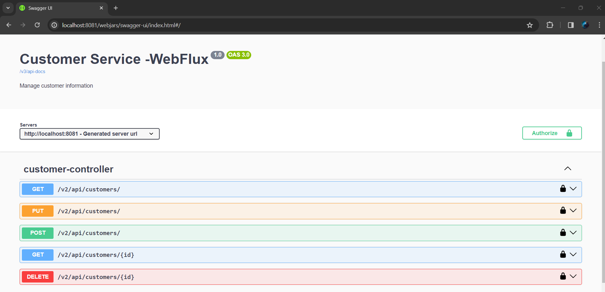
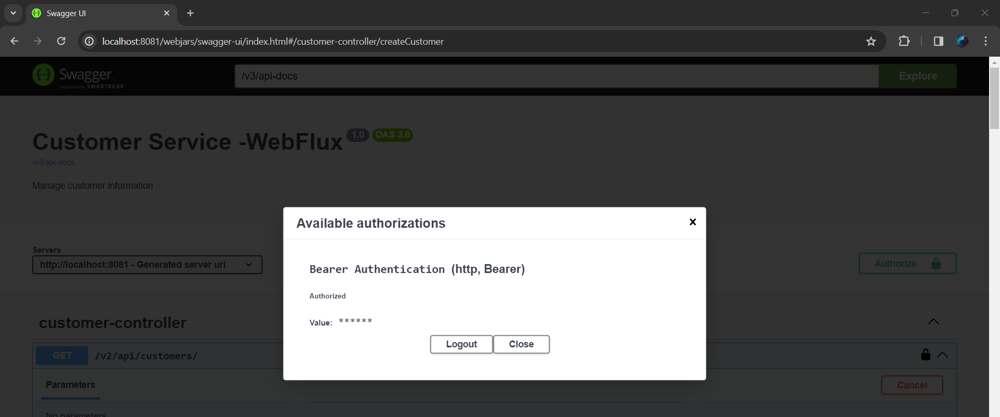
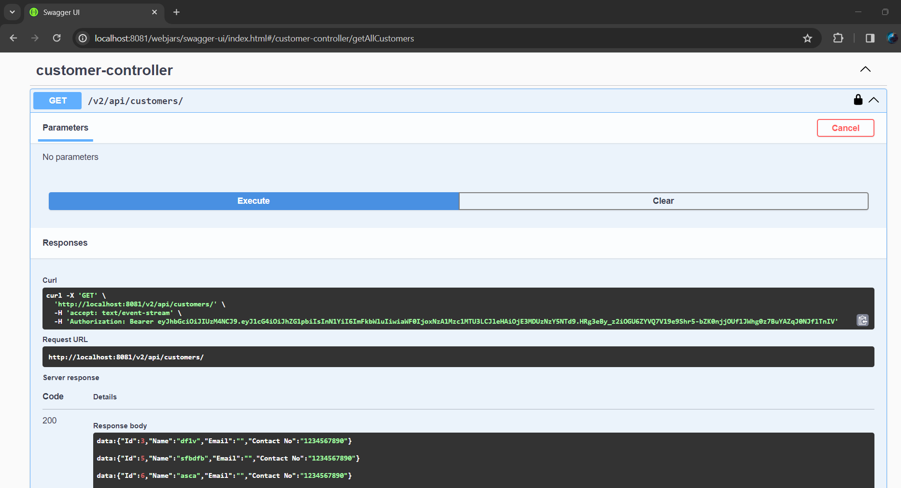
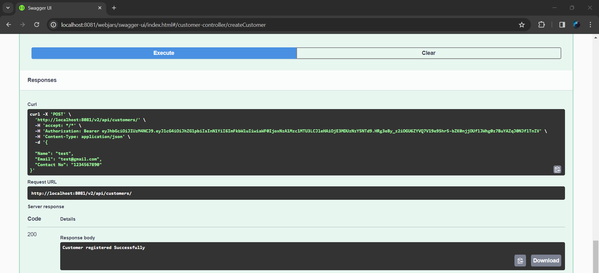
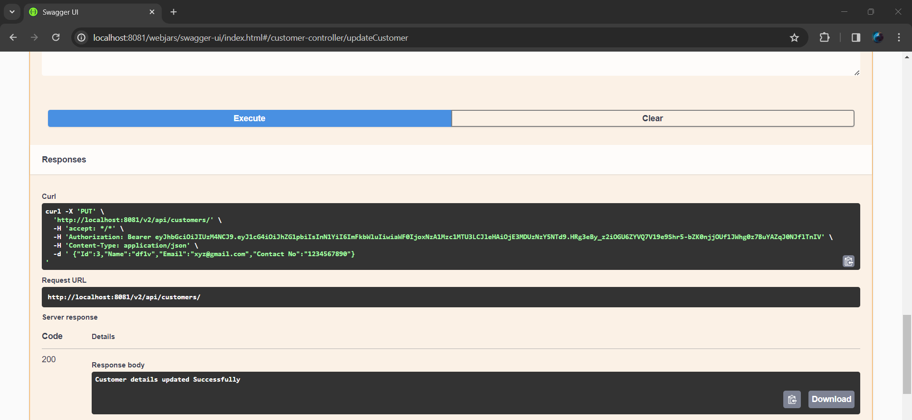

# **PROJECT NAME:** *Customer Service*

## _**Authors**_

Name| Role | Date
----- |------|------
Rajubabu N | Developer | 15-01-2014

## _**CONTENTS OF THIS FILE**_

* [Overview](#overview)
* [snapshots](#snapshots)

###  _**Overview**_

Customer service is an application built on Spring WebFlux Microservice with reactive programming.It is used to create, update, retrieve and delete customer information.Implemented with Spring Security to access the Endpoints with JWT token. Enabled Swagger API Documentation.

Implemented Reactive Feign Client dependency to make remote API calls as Reactive and Non Blocking.

Since h2 database having issues in Spring R2DBC ,service is not deployed in AWS.

###  _**SNAPSHOTS**_

Attached Swagger Screenshots while testing in Local machine.
 
SWAGGER Configured for Customer Service

Passed Bearer token with Admin Role

Retrieved all customers:

Created Customer successfully

Updated customer details using PUT request:

